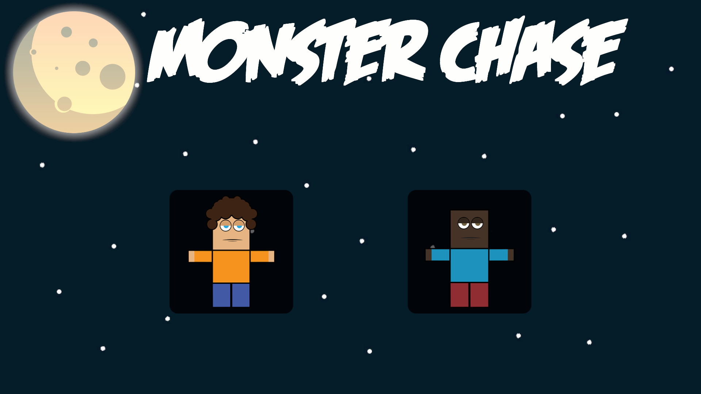
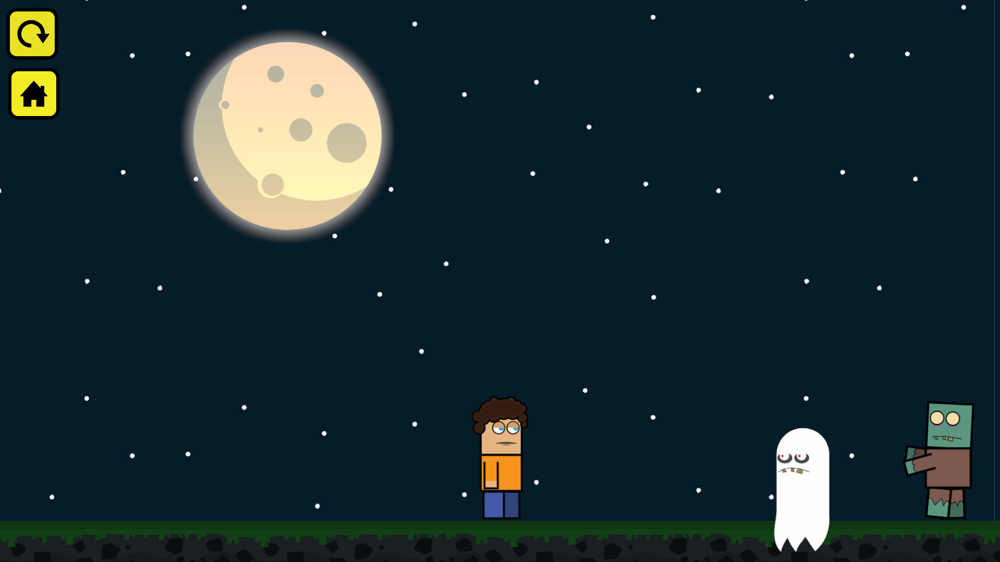

# Monster Chase

## First Playable Build | Unity Game Development Project

**Monster Chase** is a 3D survival-style game developed in Unity as my first complete end-to-end game project. The player must avoid AI-driven enemies that actively chase them across the map.

This project was built as a hands-on learning experience to understand Unity architecture, C# scripting, UI systems, and the full build/export pipeline.

---

## Project Overview

- **Engine:** Unity
- **Language:** C#
- **Platform:** Windows (64-bit)
- **Project Type:** Single-player survival prototype

The primary objective of this project was to design, develop, and export a fully functional playable build while applying core game development principles.

---

## Project Structure

```
Monster-Chase-Unity/
│
├── Assets/               # Scenes, Scripts, Models, Prefabs, UI
├── Packages/             # Unity package dependencies
├── ProjectSettings/      # Unity configuration files
├── .gitignore
└── README.md
```

### Core Directories

- **Assets/** → Contains all gameplay content and source code
- **Packages/** → Managed dependencies via Unity Package Manager
- **ProjectSettings/** → Project-level engine configurations

---

## Setup Instructions (Development Version)

To open and modify this project in Unity:

### 1. Clone the Repository

```bash
git clone https://github.com/Sithum-Bimsara/Monster-Chase-Unity.git
```

Or download the ZIP file and extract it locally.

### 2. Open in Unity Hub

- Launch **Unity Hub**
- Click **Add Project**
- Select the cloned/extracted folder
- Open using the compatible Unity version

### 3. Run the Project

- Navigate to `Assets/Scenes`
- Open:
  - `MainMenu`
  - `GamePlay`

- Click ▶ **Play** in the Unity Editor

---

## Play the Game (Executable Build)

If you prefer to play without installing Unity:

1. Navigate to the **Releases** section of this repository
2. Download:

   ```
   MonsterChase_v1.0.zip
   ```

3. Extract the archive
4. Launch:

   ```
   MonsterChase.exe
   ```

**Supported Platform:** Windows 64-bit

---

## Controls

- **W / A / S / D** → Player movement
- **Mouse** → Camera look

Objective: Survive as long as possible while avoiding chasing enemies.

---

## Screenshots




---

## Learning Outcomes

Through this project, I developed practical experience in:

- Unity project architecture and scene management
- C# scripting for gameplay mechanics
- Basic AI implementation (enemy chase logic)
- Camera systems and player controls
- UI design within Unity
- Building and exporting production-ready executables

---

## About the Developer

This project represents the starting point of my journey into game development. It demonstrates my ability to:

- Design and complete a full Unity project lifecycle
- Apply programming fundamentals in C#
- Deliver a functional, playable build

More updates and improvements are planned as I continue expanding my skills in game development.
